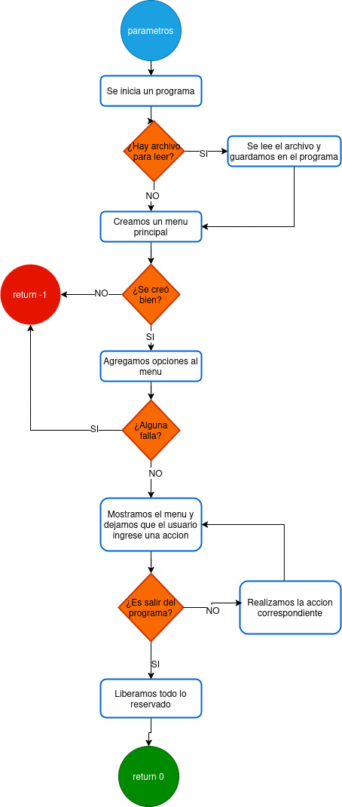
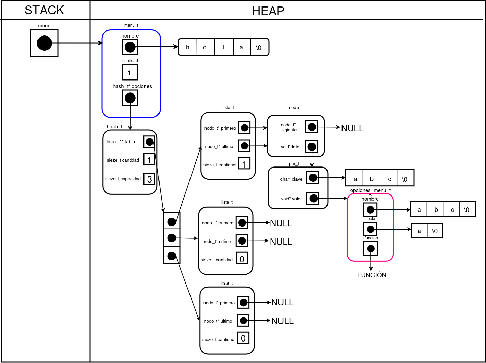

<div align="right">

</div>

# TP2

## Repositorio de Qusisami Luciana Meza Taco - 112954 - qmeza@gmail.com

- Para compilar:

```bash
make compilar
```
- Para correr tests:

```bash
make valgrind-alumno
```

- Para jugar sin archivo:
```bash
make juego-sin-arch
```

- Para jugar con archivo:
```bash
make juego ARCH=../mi_pokedex.csv
```
Aquí se reemplaza `../mi_pokedex.csv` por la ruta real de tu archivo CSV.


- Para jugar sin archivo con valgrind:
```bash
make juego-sin-arch-valgrind
```

- Para jugar con archivo:
```bash
make juego-valgrind ARCH=../mi_pokedex.csv
```
Igualmente aquí se reemplaza `../mi_pokedex.csv` por la ruta real de tu archivo CSV.

- Ejemplos de uso:

```bash
make juego-valgrind ARCH=ejemplos/largo.csv 
make juego ARCH=ejemplos/largo.csv 
```
---
## Introduccion

En `tp2.c` se ha implementado un programa interactivo que permite realizar diferentes acciones apartir de una Pokédex y ejecutar un juego de memoria basado en los datos cargados. Al iniciarse el programa, el usuario puede cargar un archivo `.csv` con información de diferentes pokemones, que luego queda disponible para realizar búsquedas, visualizaciones ordenadas (por ID o por nombre) y para utilizarse dentro del juego.


---
## Funcionamiento general
Al iniciar el programa se muestra un menú principal que el usuario puede acceder ingresando la tecla correspondiente por consola. El programa puede comenzar con un archivo de Pokédex ya cargado o permitir al usuario seleccionar uno desde el menú. Este archivo contiene la información de los pokemones que serán utilizados tanto para las búsquedas como para el juego.

El menú principal permite:
- **Cargar un archivo** `.csv` de pokemones. El usuario ingresa por consola el nombre del archivo y, si es válido, se crea la Pokédex y se rellenan los datos leídos. También se muestra un mensaje indicando si ya existía una Pokédex cargada previamente, en caso exista una anteriormente se reemplazará con el nuevo.

- **Busca pokemones por nombre o ID**. Al seleccionar esta opción se abre un submenú con las opciones disponibles:
   - Buscar por ID.
   - Buscar por nombre.
   Según la elección del usuario, se realiza la búsqueda y se muestra por pantalla el pokemon encontrado. También existe la opción de volver al menú anterior, que retorna al menú principal.

- **Muestra los pokemones disponibles** de manera ordenada, ya sea por nombre o ID, de forma similar a la búsqueda pero mostrando todos los pokemones.

- **Inicia el juego con o sin una semilla**. Si el usuario desea barajear las cartas con una semilla específica, puede hacerlo; de lo contrario, se elegirá de forma aleatoria. El juego se crea usando los pokemones de la Pokédex, cargando 18 cartas (si hay menos de 9 pokemones, se repiten hasta completar los pares). Las cartas se mezclan al azar y los jugadores alternan turnos, eligiendo pares de cartas e intentando encontrar coincidencias. El juego mantiene un historial de jugadas, actualiza los puntajes y finaliza cuando no quedan más pares, mostrando un resumen con los resultados y todas las jugadas realizadas.

- **Cambiar el estilo visual** de los menús. Hay varios estilos disponibles; cada vez que el usuario selecciona esta opción, se aplica el siguiente estilo de manera circular.
- **Finaliza el programa**, liberando toda la memoria utilizada y cerrando el programa.

En el siguiente diagrama se puede visualizar el flujo que sigue todo el programa.
<div align="center">

</div>

---

## TDA MENÚ

El TDA Menú es una estructura que permite gestionar un conjunto de opciones interactivo, cada una asociada a una tecla y a una función a ejecutar. 

A continuación se muestra una representación en memoria de cómo se organiza un menú. La imagen es un menú con una opción agregada, mostrando cómo se almacenan internamente el nombre del menú, la cantidad de opciones, la tabla hash de opciones y los datos de cada opción (nombre, tecla y función asociada).

<div align="center">

</div>

### Primitivas del TDA Menu:
- `crear_menu`: Crea un menú con el nombre indicado y la capacidad especificada (mínimo 3 o por defecto crea en 3). Devuelve un puntero al menú creado o NULL en caso de error. 
   **Justificacion:** Esta operación es fundamental porque permite inicializar la estructura del menú antes de poder utilizarla. Garantiza que el menú comience en un estado válido, con su nombre y capacidad definidos, siendo el punto de partida para todas las demás operaciones del TDA.

- `menu_agregar`: Agrega una opción al menú copiando un nombre, una tecla de selección y una función a ejecutar. Devuelve true si la opción se agregó correctamente y false en caso de error. En la imagen anterior podemos ver como se ve un menu con una opcion agregada.
**Justificacion:** Es la operación que más importante del menú. Sin crear el menú primero, no habría lugar donde guardar opciones ni nada.

- `menu_ejecutar_opcion` : Ejecuta la función asociada a la opción seleccionada mediante la tecla. Devuelve true si la ejecución fue exitosa y false en caso de error o si la opción no existe.
**Justificacion:** Hace posible que el menú cumpla su propósito: permitir que una acción se lleve a cabo cuando el usuario selecciona una opción. Sin esta operación, el menú sería solo una lista estática sin capacidad de interacción.

- `menu_eliminar_opcion`: Elimina la opción del menú asociada a la tecla indicada. Devuelve true si la eliminación fue exitosa y false si la opción no existía.
**Justificacion:** Sirve para sacar opciones que ya no hacen falta.

- `menu_cantidad`: Devuelve la cantidad de opciones disponibles en el menú. En caso de error devuelve 0.
**Justificacion:** Permite saber cuántas opciones tiene el menú en ese momento, algo útil para mostrarlo.

- `menu_nombre`: Devuelve el nombre del menú. Si ocurre algún error, devuelve NULL.
**Justificacion:** Devuelve el nombre del menú, lo que lo identifica sobre todos si hay más de uno.

- `menu_iterar`: Recorre todas las opciones del menú y aplica la función `f` a cada una. La función recibe la tecla, el nombre de la opción y el parámetro auxiliar aux. Devuelve la cantidad de opciones procesadas.
**Justificacion:** Permite recorrer todas las opciones del menú una por una y hacer algo con ellas, como mostrarlas en pantalla.

- `destruir_menu`: Libera la memoria reservada para el menú y sus opciones.
**Justificacion:** Es la operación que se usa cuando ya no se necesita el menú. Sirve para dejar todo ordenado y evitar que quede ocupando espacio de más.

### Complejidad:

- `crear_menu`: Su complejidad es O(n), n siendo la capacidad dada. Esto se debe a la creacion del hash que es O(n).

- `menu_agregar`: Las verificaciones y la reserva para una nueva opcion es O(1), en el mejor de los casos seria O(1) si la insercion de la opcion en el hash es O(1). En el peor de los casos es O(n²) ya que la inserción del hash sería O(n²).

- `menu_ejecutar_opcion`: Su complejidad promedio es O(1), sin embargo en el peor de los casos al buscar la opcion puede llegar a ser O(n), esto debido a la tabla hash.

- `menu_eliminar_opcion`: Su complejidad promedio es O(1), sin embargo en el peor de los casos al eliminar la opcion puede llegar a ser O(n²), esto debido a la organizacion en la tabla hash.

- `menu_cantidad`: Es O(1) ya que solo devuelve el valor guardado en la estructura.

- `menu_nombre`: Es O(1) ya que solo devuelve el valor guardado en la estructura.

- `menu_iterar`: Es O(n) porque itera todas las opciones del menu.

- `destruir_menu`: Es O(n²) porque destruir el hash es O(n²) y los demás `free` son O(1).

---

## TDA BARAJA

El TDA Baraja hace referencia a una colección de elementos que pueden manipularse como en una baraja de cartas, permitiendo insertar, eliminar, mezclar y consultar estados de cada posición. Además, ofrece funciones para recorrer sus elementos y gestionar su memoria de forma segura. La siguiente imagen presenta una representación del TDA Baraja en memoria, mostrando como se organiza internamente la estructura y sus elementos.

<div align="center">

</div>

### Primitivas del TDA Baraja:

- `crear_baraja`: Crea una baraja con la capacidad indicada. La capacidad debe ser mayor a 0. Devuelve un puntero a la baraja creada o NULL en caso de error.
**Justificacion:** que la baraja exista y tenga un espacio definido para almacenar elementos. Sin esta operación, no habría una estructura donde guardar cartas.

- `cantidad_baraja`: Devuelve la cantidad de elementos almacenados en la baraja, o 0 si ocurre algún error.
**Justificacion:** Brinda la cantidad de cartas ocupadas, algo útil para mostrar informacion.

- `baraja_mezclar`: Mezcla todos los elementos de la baraja según la semilla indicada. Devuelve true si se realizó correctamente.
**Justificacion:** Da la capacidad de reordenar aleatoriamente los elementos, tal y como ocurre con una baraja real. Permite cambiar el estado interno sin modificar los datos, algo esencial para usarla en juegos, simulaciones, etc.

- `baraja_insertar`: Inserta el dato en la primera posición disponible y lo marca como BOCA_ABAJO. Devuelve true si la operación fue exitosa, false si la baraja está llena o hay algún error.
**Justificacion:** Permite agregar nuevos elementos a la baraja mientras haya lugar. Es una operación básica porque sin ella la baraja no podría crecer ni recibir cartas nuevas

- `baraja_eliminar`: Elimina de la baraja el elemento en la posición indicada y lo devuelve. En caso de error devuelve NULL.
**Justificacion:** Hace posible retirar un elemento en una posición específica. Util si se necesita descartar una carta.

- `baraja_obtener`: Devuelve el elemento en la posición indicada si está BOCA_ARRIBA. Si está BOCA_ABAJO, VACIA o la posición no existe, devuelve NULL.
**Justificacion:** Permite acceder al dato de la carta, siempre y cuando se pueda. Esto simula a una carta real ya que no puedes ver sus datos si está boca abajo.

- `baraja_estado_de_elemento`: Devuelve el estado del elemento en la posición indicada: 
   - VACIA -> 0
   - BOCA_ABAJO -> 1
   - BOCA_ARRIBA -> 2. 
 Si la posición no existe o hay algún error, devuelve -1.
**Justificacion:** Es importante para saber como está la carta.

- `baraja_posicion`: Busca un elemento en la baraja usando la función comparadora y devuelve su posición. Si no existe, devuelve -1.
**Justificacion:** Permite buscar un elemento dentro de la baraja sin necesidad de recorrerla manualmente, algo clave cuando se quiere saber en qué lugar está una carta específica despues de una mezcla(por ejemplo).

- `baraja_boca_arriba_elemento`: Marca el elemento de la posición indicada como BOCA_ARRIBA si estaba BOCA_ABAJO. Devuelve true si se cambió el estado, false en caso contrario.
**Justificacion:** Permite “revelar” una carta que estaba oculta. Es una operación natural en el manejo de barajaso  juegos de cartas que requieren que los datos se revelen o no.

- `baraja_boca_abajo_elemento`: Marca el elemento de la posición indicada como BOCA_ABAJO si estaba BOCA_ARRIBA. Devuelve true si se cambió el estado, false en caso contrario.
**Justificacion:** Hace lo contrario que la anterior funcion, esta vuelve a ocultar un elemento. Permite controlar la visibilidad del dato sin eliminarlo de la baraja.

- `baraja_iterador`: Recorre los elementos de la baraja según el tipo de recorrido indicado y aplica la función f sobre cada elemento hasta que devuelva false o se recorran todos los elementos. Devuelve la cantidad de elementos procesados.
**Justificacion:** Ofrece una forma organizada de recorrer los elementos y aplicar una funcion sobre cada uno de ellos segun el tipo de recorrido que se requiera sin tener que preocuparse por cómo está implementada internamente la baraja.

- `destruir_baraja`: Libera la memoria reservada para la baraja.
**Justificacion:** Sirve para descartar la baraja cuando ya no hace falta, liberando su espacio y evitando que siga ocupando recursos innecesariamente.

- `destruir_baraja_todo`: Aplica el destructor a cada elemento almacenado y luego libera toda la memoria de la baraja.
**Justificacion:** Además de destruir la baraja, elimina correctamente cada uno de los elementos almacenados. Es útil cuando la baraja es la dueña de sus datos y debe encargarse de liberarlos también.

### Complejidad:

- `crear_baraja`: Solo se reserva memoria(suponiendo que calloc es O(1)) y se verifica, entonces su complejidad sería O(1).

- `cantidad_baraja`: Retorna una variable de la estructura, su complejidad es O(1).

- `baraja_mezclar`: Se itera n-1 veces, asi que su complejidad sería O(n).

- `baraja_insertar`: Recorre las cartas hasta una posicion vacia, en el peor de los casos sería  O(n) ya que la vacía está al ultimo.

- `baraja_eliminar`: Solo realiza operaciones constantes y para acceder usa la posicion dada, entonces su complejidad es O(1).

- `baraja_obtener`: Igualmente accede segun la posicion dada y retorna un valor, su complejidad es O(1).

- `baraja_estado_de_elemento`: Accede segun la posicion dada y devuelve el estado, su complejidad es O(1).

- `baraja_posicion`: Recorre hasta encontrar el elemento, en el peor de los casos sería O(n) ya que recorre todo.

- `baraja_boca_arriba_elemento`: Accede segun la posicion, su complejidad es O(1).

- `baraja_boca_abajo_elemento`:Accede segun la posicion, su complejidad es O(1).

- `baraja_iterador`:Recorre segun el tipo de recorrido, en el peor de los casos sería O(n) ya que recorre todo.

- `destruir_baraja`: Solo se libera memoria, seria O(1).

- `destruir_baraja_todo`: Recorre los elementos aplicando el destructor, en el peor de los casos seria O(n).

---

## Respuestas a las preguntas teóricas

- **¿Qué TDAs fueron utilizados para implementar las funcionalidades pedidas? ¿Por qué fue elegido ese TDA y no otro?**
   Los TDA usados fueron:
   - LISTA: Se eligio este TDA para guardar las jugadas de cada jugador y un historial general, además que para poder imprimir por pantalla se tenia que iterar por cada jugada algo que el TDA cola ni pila ofrecen.
   - HASH: Este TDA se usó para implementar el menu. El menu al guardar asociativamente una funcion con una tecla tiene la misma caracteristica que una tabla hash. Por eso se decidio usar un hash para el TDA menu.
   - TP1: Se usó como una pokedex en el programa. No se escogió otro TDA ya que este tenia todas las funciones necesarias para poder hacer todo el programa. Además así la reserva de memoria sería menor.

- **Explicar el TDA menú. Justifique las operaciones incluídas en el TDA.**
   Se explicó antes.

- **Explicar cualquier otro TDA o estructuras auxiliares implementadas.**
   Se implemento el TDA baraja el cual tambien se explico antes. Tambien se implementaron estructuras auxiliares para el manejo del programa y juego. Estas simplemente son para almacenar toda la informacion compartida.

- **Explique qué dificultades encontró al implementar el TP2 y cómo pudo solucionarlas.**
   Hubo dificultades al pensar la implementación del menú, ya que en un principio se percibía como muy similar a una tabla hash y no parecía tener sentido desarrollarlo por separado. Sin embargo, al analizar más profundamente las particularidades de un menú general, se identificaron diferencias clave con respecto a una tabla hash, lo que permitió avanzar y continuar con el trabajo.

   También surgieron dificultades al diseñar el soporte para submenús. Esto se resolvió mediante una función que realiza todo el proceso de un menú normal: crear, agregar, ejecutar y destruir un menu, agrupando estas operaciones dentro de la función principal, similar al flujo del programa que se presento al principio.

