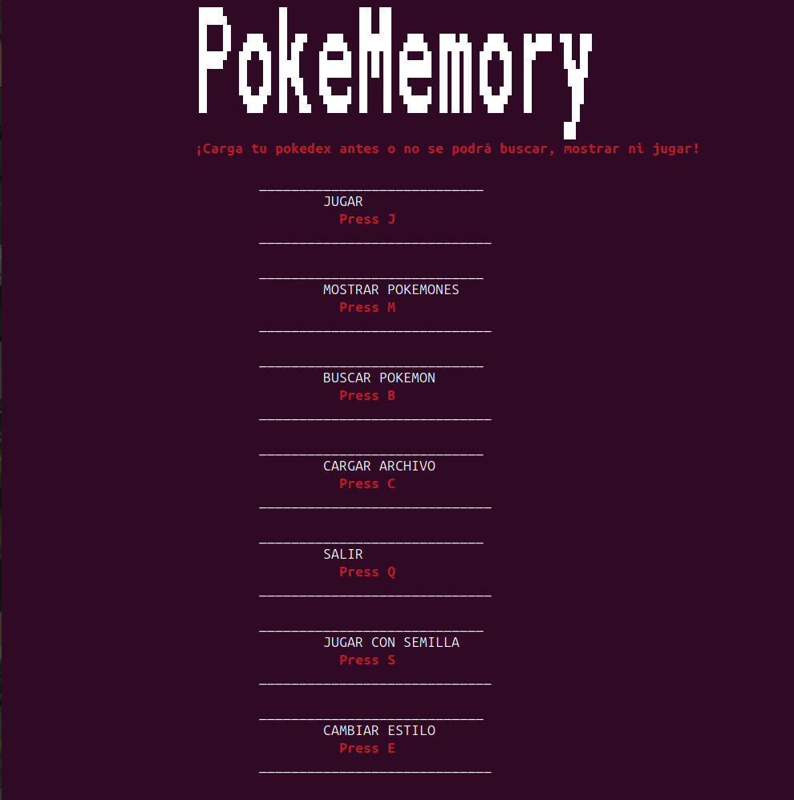
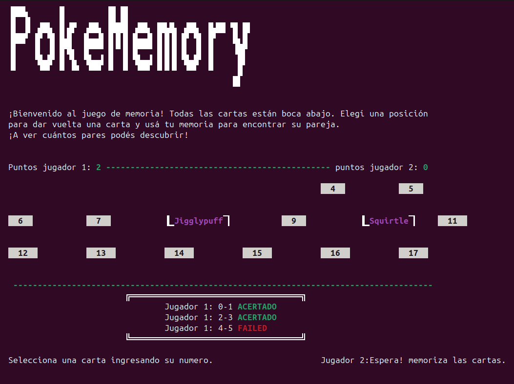

# POKEMEMORY
Trabajo práctico desarrollado en la materia de Algoritmos y Estructura de Datos - cátedra Mendez/Pandolfo

## Introducción

El programa permite cargar una Pokédex desde un archivo CSV, explorarla desde un menú interactivo y jugar un juego de memoria para dos jugadores utilizando los Pokémon cargados.

El proyecto fue diseñado reutilizando TDA's implementados durante la cursada.

> [**Nota sobre esta versión**]
> Este repositorio contiene una versión revisada y mejorada del trabajo práctico original. Esta versión no corresponde exactamente al código entregado en la materia, sino a una versión posterior.

---

## Enunciado
El enunciado original de la consigna de la materia puede encontrarse en `Enunciado.md`

## Documentación
Las instrucciones de compilación, ejecución y explicaciones se encuentran en `Informe.md`

## Visualización

    

    

